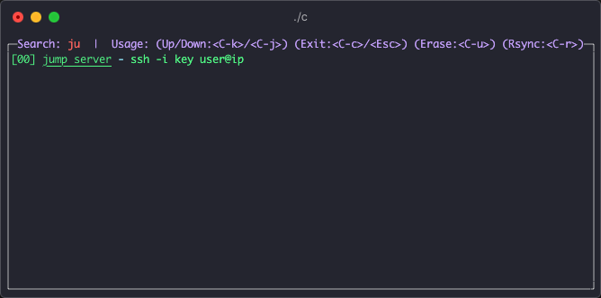

# Command Operator

[](https://github.com/Fedomn/c/actions)
[](https://github.com/Fedomn/c/actions)

Make command operation easier to use.




# Install

```shell
# macOS
curl https://raw.githubusercontent.com/Fedomn/c/master/release/c.darwin -o c && chmod +x ./c

# linux
curl https://raw.githubusercontent.com/Fedomn/c/master/release/c.linux -o c && chmod +x ./c
```

# Features

* YAML format make configuration easier
* Terminal UI make operation faster
* Fuzzy Search make searching more convenient
* Including flexible normal mode and search mode
* Support rsync upload function based on SSH command
    * ssh cmd pattern must be `ssh -i key user@ip`

# Usage

configuration demo:

```yaml
-
 name: show ip
 cmd: curl https://ifconfig.co/json
-
 name: jump server
 cmd: ssh -i key user@ip
-
 name: show date
 cmd: date
```

Terminal UI shortcuts in normal mode:

| key | operation in Normal Mode list |
| :--- | :--- |
| `j` / `<Down>` | Scroll Down |
| `k` / `<Up>` | Scroll Up |
| `<C-d>` | Scroll Half Page Down |
| `<C-u>` | Scroll Half Page Up |
| `<C-f>` | Scroll Page Down |
| `<C-b>` | Scroll Page Up |
| `<C-r>` | Rsync Upload |
| `q` / `<C-c>` / `<Escape>` | Close App |
| `/` | Into Search Mode |
| `Enter` | Select a command |
| `Backspace` | Delete the last letter of search string |


Terminal UI shortcuts in search mode:

| key | operation in Search Mode list |
| :--- | :--- |
| `<C-j>` / `<Down>` | Scroll Down |
| `<C-k>` / `<Up>` | Scroll Up |
| `<C-u>` | Erase search string |
| `<C-r>` | Rsync Upload |
| `<C-c>` / `<Escape>` | Back to Normal Mode |
| `Backspace` | Delete the last letter of search string |